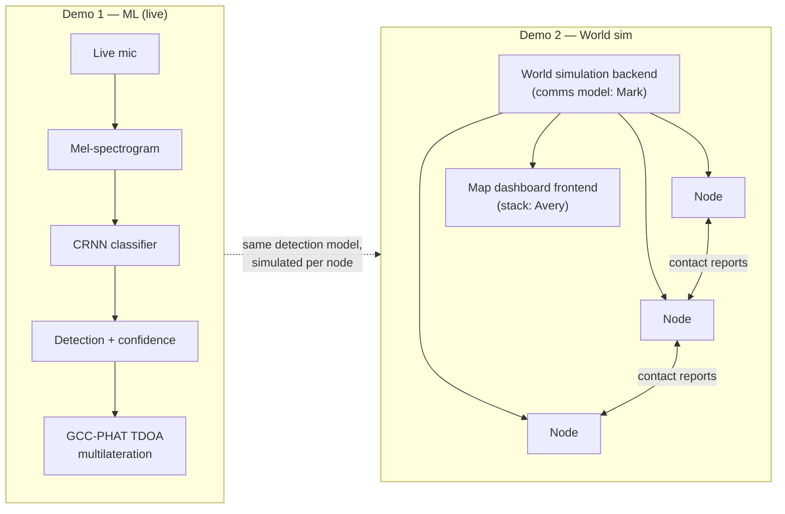

# SkyMesh — Distributed Drone Detection Net

> Acoustic drone detection at the edge, and a resilient mesh of military sensor nodes that share what they hear. Two demos, one story: hear the drone, spread the word, no single point of failure.

**DNHacks 2026 — Defense track (Second Front Systems).** Counter-UAS, drone detection, edge compute, distributed sensing, command and control.

Dedicated counter-UAS radar costs $100k+ per site and creates a single point of failure. SkyMesh takes the opposite bet: many cheap, identical acoustic sensor nodes that each detect locally and propagate contacts to their neighbors. Kill any node and the mesh keeps tracking.

## Two demos

### Demo 1 — ML: hearing the drone (live mic)

A live microphone feeds a CRNN drone-audio classifier in real time. Ported from the `justin-draft` branch and polished from there:

- **Classifier:** CRNN (conv blocks + BiGRU head) scoring 1 s windows at 500 ms hop. Front end: 16 kHz mono, 64-mel spectrogram, 50–5500 Hz.
- **Localization:** GCC-PHAT cross-correlation between node pairs → time-difference-of-arrival → least-squares multilateration. In physical sim: **8.7 m error vs 51 m** for the loudness centroid.
- **Fusion:** loudness/GPS-weighted centroid + error ellipse that visibly tightens as nodes join.

The demo: play (or fly) a drone near live mics, watch detections fire and a fused track appear.

### Demo 2 — Full-stack: the world simulation

A full-stack web application:

- **Frontend:** a map dashboard showing nodes placed on real-world terrain, drone tracks, and alert propagation. *(Stack decided by Avery.)*
- **Backend:** a world simulation emulating a distributed system. Each node represents a piece of military hardware that communicates **only with adjacent nodes** about drone presence. *(Communication model decided by Mark.)*

The demo: place nodes on the map, spawn a drone, and watch contact reports ripple node-to-node across the mesh — then kill nodes and watch the network route around the loss.

## Node model

**All nodes are identical.** Every simulated node is a self-contained hardened acoustic sensor unit with the full feature set:

- **Detect** — on-board acoustic classification (the Demo 1 pipeline is what each node "runs").
- **Relay** — exchange contact reports with adjacent nodes; no central server required.
- **C2-capable** — any node can aggregate the local picture and serve it to an operator.

This is deliberate: a flat mesh of peers has no privileged node to destroy. Heterogeneous archetypes (dedicated relays, C2 stations) and real-hardware flavor (radar pickets, RF sniffers as distinct node types) are roadmap, not v1. *(Mark may revise the node model alongside the communication design.)*



## Repo layout (monorepo)

```
dnhacks-node/
  ml-demo/             # Demo 1: live-mic drone audio detection
    server/            # ingest, CRNN scoring (model.py), TDOA (tdoa.py), fusion
    app/               # node client (mic capture, heartbeat/detection sender)
  sim-demo/            # Demo 2: full-stack world simulation
    frontend/          # map dashboard — stack TBD (Avery)
    backend/           # distributed node sim — comms model TBD (Mark)
  README.md
```

`ml-demo/` is a port of the working `justin-draft` branch (CRNN + fusion + TDOA + Leaflet map, all e2e-tested). `sim-demo/` is greenfield.

## Demo 1 details

- Live mic → mel-spectrogram → CRNN → drone probability per 1 s window.
- Detections above threshold ship a 2 s WAV clip + timestamp + position + loudness.
- ≥4 concurrent clips trigger GCC-PHAT multilateration; otherwise weighted centroid + ellipse.
- No clock sync needed: PHAT correlation aligns clip content, coarse timestamps only bound the search window.
- Replay endpoints re-emit recorded sessions — demo insurance if live audio fails.

## Demo 2 details

- Backend simulates a world: node positions, drone flight paths, acoustic detection ranges, and node-to-node message passing between adjacent nodes only.
- Frontend renders the live picture: node health, contact reports propagating, fused drone tracks.
- Design authority: **Avery** owns the frontend stack, **Mark** owns the distributed communication model (propagation, adjacency, failure handling).

## Quickstart

### Demo 1 (ml-demo)

```bash
cd ml-demo/server
python -m venv .venv && source .venv/bin/activate
pip install -r requirements.txt
uvicorn app:app --reload --port 8000
# open the node client, allow mic; watch: tail -f events.jsonl
```

### Demo 2 (sim-demo)

Quickstart lands once Avery (frontend stack) and Mark (sim/comms model) commit their designs.

## Roadmap

- Node archetypes: dedicated relays, C2 stations, mixed-modality sensors (RF, radar picket, EO/IR).
- Real-hardware flavor: model nodes on actual counter-UAS equipment classes with realistic ranges.
- Demo convergence: run the Demo 1 classifier inside each Demo 2 simulated node.
- Byzantine-tolerant contact reports for adversarial-node resistance.

## Built at DNHacks 2026

Defense track presented by Second Front Systems. Roles: ML/audio (Demo 1 port + polish), frontend (map dashboard — Avery), distributed sim (comms model — Mark), story/submission.
