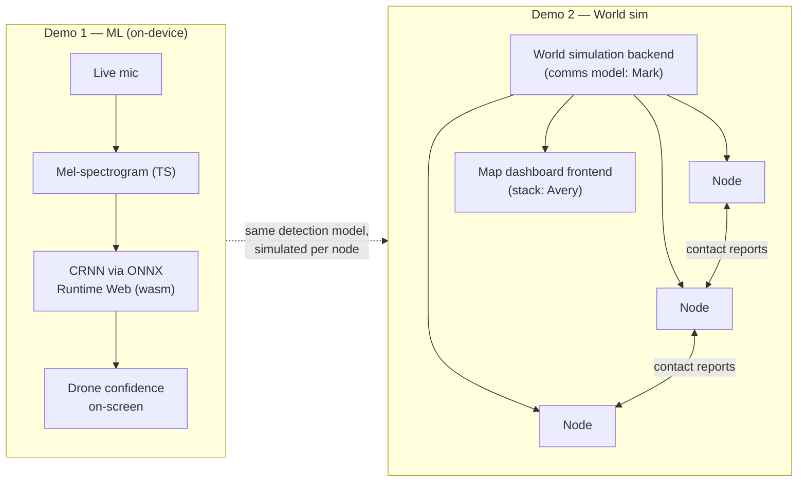

# SkyMesh — Distributed Drone Detection Net

> Acoustic drone detection at the edge, and a resilient mesh of military sensor nodes that share what they hear. Two demos, one story: hear the drone, spread the word, no single point of failure.

**DNHacks 2026 — Defense track (Second Front Systems).** Counter-UAS, drone detection, edge compute, distributed sensing, command and control.

Dedicated counter-UAS radar costs $100k+ per site and creates a single point of failure. SkyMesh takes the opposite bet: many cheap, identical acoustic sensor nodes that each detect locally and propagate contacts to their neighbors. Kill any node and the mesh keeps tracking.

## Two demos

### Demo 1 — ML: hearing the drone (live mic, fully on-device)

A live microphone feeds a CRNN drone-audio classifier **running entirely on the phone** (ONNX Runtime Web). Demo 1 strictly showcases one thing: confidence in the existence of a drone.

- **Classifier:** CRNN (conv blocks + BiGRU head) scoring 1 s windows at 500 ms hop. Front end: 16 kHz mono, 64-mel spectrogram, 50–5500 Hz — computed in TypeScript, bit-parity with the PyTorch reference (worst diff 5e-8 across the DADS test set).
- **Edge-native:** no server, no location, no network after first load. Flip the phone to airplane mode — it still detects. Each phone is exactly the self-contained Detect node the product describes.

The demo: play (or fly) a drone near a phone, watch the on-device confidence slam to ~100% within a second. Localization and the fused track picture belong to Demo 2.

### Demo 2 — Full-stack: the world simulation

A full-stack web application:

- **Frontend:** a map dashboard showing nodes placed on real-world terrain, drone tracks, and alert propagation. *(Stack decided by Avery.)*
- **Backend:** a world simulation emulating a distributed system. Each node represents a piece of military hardware that communicates **only with adjacent nodes** about drone presence. *(Communication model decided by Mark.)*

The demo: place nodes on the map, spawn a drone, and watch contact reports ripple node-to-node across the mesh — then kill nodes and watch the network route around the loss.

## Node model

**All nodes are identical.** Every simulated node is a self-contained hardened acoustic sensor unit with the full feature set:

- **Detect** — on-board acoustic classification (the Demo 1 pipeline is what each node "runs").
- **Relay** — exchange contact reports with adjacent nodes; no central server required.
- **C2-capable** — any node can aggregate the local picture and serve it to an operator.

This is deliberate: a flat mesh of peers has no privileged node to destroy. Heterogeneous archetypes (dedicated relays, C2 stations) and real-hardware flavor (radar pickets, RF sniffers as distinct node types) are roadmap, not v1. *(Mark may revise the node model alongside the communication design.)*



## Repo layout (monorepo)

```
dnhacks-node/
  ml-demo/             # Demo 1: on-device drone audio detection
    app/               # the node: mic capture, TS mel front end, ONNX CRNN
    public/            # drone_crnn.onnx (exported model) + ORT wasm runtime
    server/            # dev/test harness: PyTorch reference (model.py),
                       # ONNX export, parity + e2e tests. Not in the demo path.
  sim-demo/            # Demo 2: full-stack world simulation
    frontend/          # map dashboard — stack TBD (Avery)
    backend/           # distributed node sim — comms model TBD (Mark)
  README.md
```

`ml-demo/` runs the CRNN in-browser — verified against the PyTorch reference. `sim-demo/` is greenfield.

## Demo 1 details

- Live mic → TS mel-spectrogram → on-device CRNN (ONNX Runtime Web) → drone probability per 1 s window, scored every 500 ms.
- Output is exactly one number: drone confidence. Big readout, DRONE DETECTED banner above threshold, detection counter.
- Only permission asked: microphone. No GPS, no accounts, no server round-trips — audio never leaves the phone.
- Offline-capable: page + 6 MB model cache on first load; detection keeps working in airplane mode.
- Multi-node localization (TDOA/fusion) is deliberately out of scope here — that story is Demo 2's, where every simulated node runs this same detector.

## Demo 2 details

- Backend simulates a world: node positions, drone flight paths, acoustic detection ranges, and node-to-node message passing between adjacent nodes only.
- Frontend renders the live picture: node health, contact reports propagating, fused drone tracks.
- Design authority: **Avery** owns the frontend stack, **Mark** owns the distributed communication model (propagation, adjacency, failure handling).

## Quickstart

### Demo 1 (ml-demo)

```bash
cd ml-demo
npm install        # also vendors the ONNX wasm runtime into public/ort/
npm run dev        # open http://localhost:3000, allow mic, play drone audio
npm run test:parity  # browser pipeline vs PyTorch reference (needs server/.venv)
```

### Demo 2 (sim-demo)

Quickstart lands once Avery (frontend stack) and Mark (sim/comms model) commit their designs.

## Roadmap

- Node archetypes: dedicated relays, C2 stations, mixed-modality sensors (RF, radar picket, EO/IR).
- Real-hardware flavor: model nodes on actual counter-UAS equipment classes with realistic ranges.
- Demo convergence: run the Demo 1 classifier inside each Demo 2 simulated node.
- Multi-node localization: GCC-PHAT TDOA multilateration between real phone nodes (prototyped in `ml-demo/server/tdoa.py`: 8.7 m error vs 51 m loudness centroid in physical sim).
- Byzantine-tolerant contact reports for adversarial-node resistance.

## Built at DNHacks 2026

Defense track presented by Second Front Systems. Roles: ML/audio (Demo 1 port + polish), frontend (map dashboard — Avery), distributed sim (comms model — Mark), story/submission.
