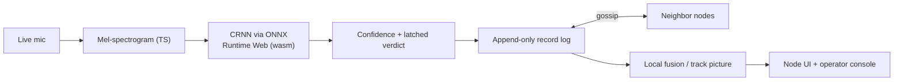

# SkyMesh — Distributed Drone Detection Net

> Acoustic drone detection at the edge, and a resilient mesh of phone sensor nodes that share what they hear. Each phone detects locally, gossips confidence records, and computes the same fused picture.

**DNHacks 2026 — Defense track (Second Front Systems).** Counter-UAS, drone detection, edge compute, distributed sensing, command and control.

Dedicated counter-UAS radar costs $100k+ per site and creates a single point of failure. SkyMesh takes the opposite bet: many cheap, identical acoustic sensor nodes that each detect locally and propagate contacts to their neighbors. Kill any node and the mesh keeps tracking.

## Product flow

SkyMesh is one app:

- **Phone node (`/`)** — live microphone → TypeScript mel-spectrogram → CRNN via ONNX Runtime Web → drone confidence. Audio never leaves the phone; only likelihood records are shared.
- **Unified workspace (`/station`)** — a dominant satellite basemap with real admitted participants. The right-hand control column contains onboarding, participant directory, scenario controls, inspector, topology, confidence, activity, and link emulation. It scrolls independently on desktop and stacks below the map on phones. No FitBoard scaling, panel switching, or pagination.
- **Scenario controls** — flight overlays, impact, interference, isolation, and replay operate on the same participant topology. Synthetic drone overlays never create microphone readings. Link-failure controls intentionally affect the real session relay.
- **Compatibility (`/admin`, `/operator`)** — both redirect to the unified `/station` page with the session preserved. There is no separate fake-node simulator in the navigation.
- **Relay (`server/relay.py`)** — WebSocket transport for browser nodes. It routes opaque peer messages and serves the static export for one-origin HTTPS demos.

## Node model

All nodes are identical peers. Every phone can:

- **Detect** — on-board acoustic classification.
- **Relay** — exchange contact reports with adjacent nodes.
- **Store** — keep the append-only record log.
- **Fuse** — compute the local track picture from its own replica.
- **Serve** — render what it knows without asking a privileged backend for the answer.

The browser relay is a demo transport constraint, not the data model. In real hardware, nodes would run the same protocol over direct radio links.



## Repo layout

```text
dnhacks-node/
  app/                # Next.js app routes and client mesh/detection logic
  app/lib/detector/   # canonical on-device detector: mic, mel, ONNX wrapper
  public/             # ONNX model, ORT wasm, drone audio, 3D model
  server/             # WebSocket relay and static-file serving
  tests/              # unit, integration, gossip, relay, fusion, scenario tests
  README.md
```

## Quickstart

```bash
npm install
python3 -m venv server/.venv && ./server/.venv/bin/pip install -r server/requirements.txt
npm run relay   # FastAPI relay on :8001
npm run dev     # Next.js on :3000
```

Open `/station` on the laptop. Phones scan the QR and join `/` for the same session.

For a public phone-safe demo:

```bash
npm run demo:public
```

That checks for `server/.venv` and `cloudflared`, builds a static app, serves it from the relay beside `/ws`, waits for `/health`, then parses the trycloudflare URL, prints the `/station/` URL, and opens it. Phones scan the QR on that station page, which points back into the same tunnel.

## Tests

```bash
npm test   # mesh, fusion, gossip, relay, scenario suites
npm run build
```

Browser smokes (relay plus the app must already be running):

```bash
APP_URL=http://127.0.0.1:8001 node tests/detector-smoke.mjs   # fake mic WAV → mel → ONNX CRNN → gossip
APP_URL=http://127.0.0.1:8001 node tests/ui-smoke.mjs           # four nodes join, all rows render without pagination
UI_BASE_URL=http://localhost:3000 node tests/ui-viewport-smoke.mjs  # map-first desktop/mobile layout
APP_URL=http://localhost:3000 node tests/operator-ui.mjs           # unified participant and scenario workflow
```

## What to say honestly

State and computation are distributed: no fused picture exists anywhere but on the phones. Delivery in the browser demo still uses a relay because browsers cannot listen for inbound peer connections. The accurate claim is: the relay routes messages it cannot read, phones hold and compute the picture, and the same protocol can run directly on real hardware links.

## Built at DNHacks 2026

Defense track presented by Second Front Systems. Roles: ML/audio, frontend/operator map, distributed mesh/comms, story/submission.

## Design system

The UI uses IBM Carbon React with the **g100** dark theme. The document-level
`cds--g100` class supplies first-paint CSS tokens, while `DesignSystem` supplies
the matching React theme context. Carbon owns buttons, tags, and the operations
header. The map takes the main column and supporting controls scroll in the
sidebar. There is no whole-page scaling or panel switcher. Custom maps, graphs, and tables retain
their domain behavior and use the semantic token bridge in `app/carbon.css`.

- Use `ActionButton` for native button handlers and primary/tertiary/danger hierarchy.
- Use Carbon components for new controls rather than duplicating their styles.
- Keep detection, missing data, connection health, and simulation distinct in text.
- Preserve reduced-motion support. Non-Carbon buttons keep a 44px minimum height;
  Carbon buttons use Carbon sizing, and the phone enrollment button stays >= 44px.
- Do not remove the document theme class: React theme context alone does not set CSS tokens.

The current acceptance commands are listed below. Older layout-specific
`carbon-ui.mjs`, `ui-design-smoke.mjs`, and historical acceptance documents describe
previous paginated/FitBoard layouts and are not the unified workspace's acceptance
entrypoints. Live mobile microphone permissions still require device testing.

## Unified participant map and simulation

The console uses a Leaflet/Esri World Imagery satellite basemap with the live room
frame projected over it. **Area overview** shows the surrounding area;
**Fit participant area** zooms into the outlined room. Real phones do not supply
GPS coordinates. The default Washington, DC anchor is explicitly illustrative.
**Set map anchor** accepts a site latitude/longitude and saves this display
preference per session in this browser only. It does not change room coordinates,
fusion inputs, or participant records, and is not synchronized to other consoles.
Pan outside the outlined room and use its interior for participant/scenario
interactions. External tiles require network access; an explicit warning appears
on failure while the live overlay stays usable.

Admitted participants without assigned positions appear as
dashed **unplaced** markers in a staging row. Those temporary display coordinates
are never published or used for fusion. Dragging a marker, explicitly placing a
selected participant, or choosing **auto-place** publishes its room configuration
through gossip. Auto-place is an operator-requested schematic layout, not measured
physical location. Departed participants disappear even though old records remain
in the replica.

Selecting a marker opens its inspector without changing topology. **Link
participants** explicitly enables pairwise link editing. The passive observer
connects to admitted nodes so live readings and position records flow immediately,
but it never relays between sensors or heals their partitions.

The simulator algorithms imported from Mark's branch remain available as tested
source modules under `app/operator/`, but the active page uses live `RoomMap`,
`AdminChannel`, mesh records, and room-scale scenario controls. The geographic
placement optimizer and independent synthetic `SimWorld` are not used as truth for
real participants. Adapting that advisor to calibrated room-scale parameters
remains separate work. Geographic tiles are a visual reference, not sensor evidence.

Acceptance commands (use a free local port):

```bash
npm test
npm run build
npm run build:static
server/.venv/bin/uvicorn relay:app --app-dir server --host 127.0.0.1 --port 8128
# In another terminal:
APP_URL=http://127.0.0.1:8128 node tests/operator-ui.mjs
APP_URL=http://127.0.0.1:8128 node tests/geographic-ui.mjs
UI_BASE_URL=http://127.0.0.1:8128 node tests/ui-viewport-smoke.mjs
APP_URL=http://127.0.0.1:8128 node tests/ui-smoke.mjs
```

`geographic-ui.mjs` verifies real loaded map tiles, attribution, camera controls,
anchor validation/persistence, and tile-outage fallback.
`operator-ui.mjs` checks actual browser join/admission, no fabricated markers,
staging versus physical placement, position propagation, keyboard inspection,
scenario overlays on the same nodes, departure cleanup, and legacy-route session
preservation. `ui-viewport-smoke.mjs` checks nine desktop/mobile sizes for map
prominence, visible room canvas, accessible controls, and horizontal overflow.
`ui-smoke.mjs` checks four participant browsers, gossip convergence, placement,
explicit link editing, link cuts, scenario flight/replay, and all participant rows.
Real mobile microphone permissions and acoustic calibration still require device
testing.

Dependency audit at integration time reports existing Next.js/PostCSS advisories.
This UI change does not force a breaking framework upgrade.
