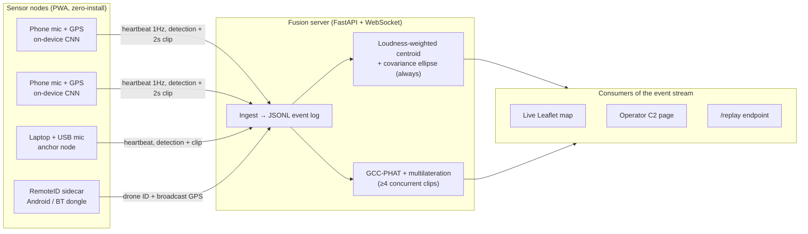

# SkyMesh — Crowd-Sourced Drone Detection Net

> Every phone and laptop in a crowd becomes a drone-detection sensor. Open a URL, and your mic + GPS join a mesh that detects, identifies, and triangulates nearby drones on a live map.

**DNHacks 2026 — Defense track (Second Front Systems).** Counter-UAS, drone detection, edge compute, distributed sensing, command and control.

Dedicated counter-UAS radar costs $100k+ per site and doesn't scale to every school, base gate, or public event. SkyMesh's marginal sensor cost is **$0** — the sensors are already in everyone's pocket. Coverage scales with the number of people present. Accuracy improves with every node that joins.

## The 3-minute demo

1. Judge scans a **QR code** → their phone joins as a node, appears on the live map. No install.
2. Drone spins up → phones light up with detections → fused track appears with an error ellipse.
3. A 5th and 6th node join → ellipse visibly tightens: *"4 nodes, ±25 m. 6 nodes, ±9 m."*
4. Operator page shows track history, alert log, and RemoteID identity when captured — including the punchline: *"This one is under 250 g and broadcasts nothing — we hear it anyway."*
5. Close: attritable, massively distributed sensing with zero marginal hardware cost. Roadmap: hardened fixed nodes for base perimeters, integration into existing C2.

Fallbacks: flying banned → phone speaker playing recorded drone audio at a known position (stated honestly, sensing math is identical). Venue too loud → pre-recorded live-run video + replay dataset animating the real map UI.

## How it works

**Topology: distributed sensing, centralized fusion.** Edge detection on-device, centralized fusion server. No P2P mesh, no consensus — all nodes are trusted volunteers contributing *measurements*, not conflicting state, so there is nothing to vote on. GCC-PHAT fusion needs all clips in one place anyway. Bad-mic outliers are handled statistically at fusion time. This mirrors real C2 doctrine: distributed sensing, centralized fusion.



**Event-stream schema first.** Everything is a producer/consumer of three JSONL event types:

```jsonc
// heartbeat (1 Hz when no detection)
{"type":"heartbeat","node_id":"abc123","t":1725550000.0,"lat":38.9,"lon":-77.04,"loudness":0.12}
// detection (threshold > 0.7)
{"type":"detection","node_id":"abc123","t":1725550001.5,"conf":0.91,"clip_ref":"/clips/abc123_1725550001.wav","lat":38.9,"lon":-77.04,"loudness":0.83}
// fused track (server output)
{"type":"track","t":1725550002.0,"lat":38.9001,"lon":-77.0401,"err_m":9.2,"n_nodes":6}
```

Log view, replay, and any later UI are interchangeable frontends over this stream. Early in the build the primary interface is the terminal (`tail -f` on the event stream); the Leaflet map + operator page are late-stage consumers built only after fusion works end-to-end.

## Repo layout

This repo is the **sensor node PWA**. The fusion server lives alongside it (same repo under `server/`, or a sibling repo — decided at kickoff).

```
dnhacks-node/          # this repo: sensor node PWA (Next.js, deploy to Vercel)
  app/
    page.tsx           # join screen: one tap → listening
    listen/            # mic loop, classifier, heartbeat/detection sender
    lib/
      audio.ts         # getUserMedia → WebAudio → mel-spectrogram
      model.ts         # TF.js classifier (YAMNet embeddings + head, or compact CNN)
      geo.ts           # geolocation + loudness
  public/
    manifest.webmanifest
server/                # fusion server (FastAPI + WebSocket) — see server/README
  app.py               # ingest, centroid + ellipse, GCC-PHAT multilateration, /replay
  events.jsonl         # append-only event log
```

## Node details (iPhone-first, zero-install)

- Runs as a **plain Safari tab** (not Add-to-Home-Screen — standalone-mode mic is flaky on iOS).
- Request mic with `echoCancellation: false, noiseSuppression: false, autoGainControl: false` — iOS voice processing mangles drone audio.
- Acquire **Screen Wake Lock** (iOS 16.4+) and show a visible "listening" animation so nodes stay foregrounded — screen lock/backgrounding kills the mic.
- Pipeline: `getUserMedia → WebAudio → mel-spectrogram → tiny in-browser classifier (TF.js)`.
- On detection with confidence > 0.7: send 2 s WAV chunk + coarse timestamp + GPS + loudness to server. Otherwise send 1 Hz heartbeat (loudness + position).
- Privacy: inference is on-device; raw audio leaves the phone only as 2 s detection clips, opt-in. No continuous streaming.

## Fusion server details

- **Stack:** FastAPI + WebSocket, single box. Ingest all events → append to JSONL log.
- **Always on:** loudness-weighted centroid + covariance ellipse.
- **Stretch:** when ≥4 concurrent clips, GCC-PHAT cross-correlation for pairwise delays → least-squares multilateration. Coarse 500 ms trigger alignment only — precise delay comes from correlation, so no clock-sync rabbit hole.
- **`/replay` endpoint** re-emits a recorded session. Demo insurance.
- **RemoteID sidecar (bonus node type):** one Android phone running the open-source OpenDroneID app, or a laptop + BT dongle, feeds drone ID + broadcast GPS into the same track. Never the critical path.

## Quickstart

### Node PWA

```bash
npm install
npm run dev
# open http://localhost:3000 on your phone (same Wi-Fi), tap Join, allow mic + location
```

Deploy: push to Vercel, print the URL as a QR code for judges.

### Fusion server

```bash
cd server
python -m venv .venv && source .venv/bin/activate
pip install -r requirements.txt
uvicorn app:app --reload --port 8000
# node PWA points at wss://<server>/ws
# watch the stream: tail -f events.jsonl
# replay a recorded session: curl http://localhost:8000/replay?session=demo1
```

### Anchor nodes (recommended)

2× laptops with cheap USB mics (~$20 ea) beat phone AGC and carry detection while phones contribute geometry. Bring battery packs and charge everything beforehand.

## Training data

Prepared in advance (data prep, no code): HuggingFace `geronimobasso/drone-audio-detection-samples` (DADS, largest public drone-audio set) + ESC-50 negatives. Pretrained compact CNN / YAMNet-head is data prep but verified against the event AI policy at kickoff; fallback is training from DADS on Colab at the event (~20 min).

## Operator (C2) view

One-page operator view: track history, per-node health, alert log, RemoteID identity when captured. This is what makes it command and control, not a demo toy.

## Roadmap

- Hardened fixed nodes for base perimeters and critical infrastructure.
- Same fusion bus accepts new modalities: camera bearing nodes, RF sniffers.
- Any node promotable to fusion server (stateless over the event stream) — Byzantine-tolerant sensing is the adversary-resistance roadmap, not a weekend build.

## Built at DNHacks 2026

Defense track presented by Second Front Systems. Team roles: ML/audio (browser classifier, threshold tuning, GCC-PHAT), frontend (PWA node UX, Leaflet map, ellipse-shrink moment), backend (ingest, fusion, operator page), float/lead (drone ops, RemoteID sidecar, story, video, submission).
