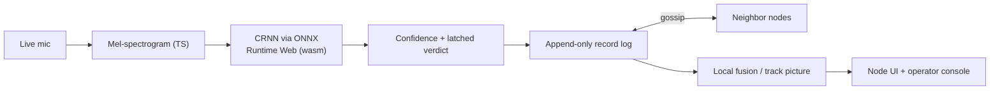

# SkyMesh — Distributed Drone Detection Net

> Acoustic drone detection at the edge, and a resilient mesh of phone sensor nodes that share what they hear. Each phone detects locally, gossips confidence records, and computes the same fused picture.

**DNHacks 2026 — Defense track (Second Front Systems).** Counter-UAS, drone detection, edge compute, distributed sensing, command and control.

Dedicated counter-UAS radar costs $100k+ per site and creates a single point of failure. SkyMesh takes the opposite bet: many cheap, identical acoustic sensor nodes that each detect locally and propagate contacts to their neighbors. Kill any node and the mesh keeps tracking.

## Product flow

SkyMesh is one app:

- **Phone node (`/`)** — live microphone → TypeScript mel-spectrogram → CRNN via ONNX Runtime Web → drone confidence. Audio never leaves the phone; only likelihood records are shared.
- **Operator console (`/station`)** — laptop screen under the `SkyMesh / Operations` header. The left sidebar holds the compact join QR and the clickable 3D drone/audio demo; the right side renders the admin dashboard (node admission, room map, topology/link controls, confidence graphs, fused localization). A `FitBoard` wrapper (`app/lib/FitBoard.tsx`) scales the whole board down to fit the viewport, so all seven sections (sensor confidence, network topology, scenario controls, scenario activity, link emulation, sensor directory, sensor inspector) plus QR and drone canvas are visible at once. There is no panel switcher and no pagination: every admitted sensor, link row, and retained activity event renders in full. Link emulation is shown by default, and the inspector shows a placeholder until a sensor is selected on the map.
- **Admin compatibility (`/admin`)** — redirects to `/station` preserving the session.
- **Relay (`server/relay.py`)** — WebSocket transport for browser nodes. It routes opaque peer messages and serves the static export for one-origin HTTPS demos.

## Node model

All nodes are identical peers. Every phone can:

- **Detect** — on-board acoustic classification.
- **Relay** — exchange contact reports with adjacent nodes.
- **Store** — keep the append-only record log.
- **Fuse** — compute the local track picture from its own replica.
- **Serve** — render what it knows without asking a privileged backend for the answer.

The browser relay is a demo transport constraint, not the data model. In real hardware, nodes would run the same protocol over direct radio links.



## Repo layout

```text
dnhacks-node/
  app/                # Next.js app routes and client mesh/detection logic
  app/lib/detector/   # canonical on-device detector: mic, mel, ONNX wrapper
  public/             # ONNX model, ORT wasm, drone audio, 3D model
  server/             # WebSocket relay and static-file serving
  tests/              # unit, integration, gossip, relay, fusion, scenario tests
  README.md
```

## Quickstart

```bash
npm install
python3 -m venv server/.venv && ./server/.venv/bin/pip install -r server/requirements.txt
npm run relay   # FastAPI relay on :8001
npm run dev     # Next.js on :3000
```

Open `/station` on the laptop. Phones scan the QR and join `/` for the same session.

For a public phone-safe demo:

```bash
npm run demo:public
```

That checks for `server/.venv` and `cloudflared`, builds a static app, serves it from the relay beside `/ws`, waits for `/health`, then parses the trycloudflare URL, prints the `/station/` URL, and opens it. Phones scan the QR on that station page, which points back into the same tunnel.

## Tests

```bash
npm test   # mesh, fusion, gossip, relay, scenario suites
npm run build
```

Browser smokes (relay plus the app must already be running):

```bash
APP_URL=http://127.0.0.1:8001 node tests/detector-smoke.mjs   # fake mic WAV → mel → ONNX CRNN → gossip
APP_URL=http://127.0.0.1:8001 node tests/ui-smoke.mjs           # four nodes join, all rows render without pagination
UI_BASE_URL=http://localhost:3000 node tests/ui-viewport-smoke.mjs  # all 7 sections + QR + drone fit, 1920x1080 down to 390x844
UI_BASE_URL=http://localhost:3000 node tests/ui-design-smoke.mjs    # palette, fonts, Carbon controls, onboarding, focus
UI_BASE_URL=http://localhost:3000 node tests/carbon-ui.mjs          # g100 tokens, drone toggle, phone touch target
```

## What to say honestly

State and computation are distributed: no fused picture exists anywhere but on the phones. Delivery in the browser demo still uses a relay because browsers cannot listen for inbound peer connections. The accurate claim is: the relay routes messages it cannot read, phones hold and compute the picture, and the same protocol can run directly on real hardware links.

## Built at DNHacks 2026

Defense track presented by Second Front Systems. Roles: ML/audio, frontend/operator map, distributed mesh/comms, story/submission.

## Design system

The UI uses IBM Carbon React with the **g100** dark theme. The document-level
`cds--g100` class supplies first-paint CSS tokens, while `DesignSystem` supplies
the matching React theme context. Carbon owns buttons, tags, and the operations
header. All dashboard sections render simultaneously inside `FitBoard`; there is no
panel switcher. Custom maps, graphs, and tables retain
their domain behavior and use the semantic token bridge in `app/carbon.css`.

- Use `ActionButton` for native button handlers and primary/tertiary/danger hierarchy.
- Use Carbon components for new controls rather than duplicating their styles.
- Keep detection, missing data, connection health, and simulation distinct in text.
- Preserve reduced-motion support. Non-Carbon buttons keep a 44px minimum height;
  Carbon buttons use Carbon sizing, and the phone enrollment button stays >= 44px.
- Do not remove the document theme class: React theme context alone does not set CSS tokens.

UI regression checks against a running production or development server:

```bash
UI_BASE_URL=http://localhost:3000 node tests/carbon-ui.mjs
UI_BASE_URL=http://localhost:3000 node tests/ui-design-smoke.mjs
UI_BASE_URL=http://localhost:3000 node tests/ui-viewport-smoke.mjs
```

These check theme contrast tokens, drone-mode controls, responsive overflow,
simultaneous rendering of all sections with no pagination, and phone enrollment
button sizing. Live microphone permissions and multi-phone enrollment still
require device acceptance testing.
