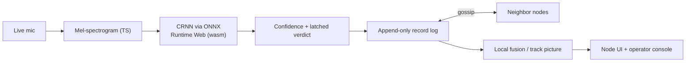

# SkyMesh — Distributed Drone Detection Net

> Acoustic drone detection at the edge, and a resilient mesh of phone sensor nodes that share what they hear. Each phone detects locally, gossips confidence records, and computes the same fused picture.

**DNHacks 2026 — Defense track (Second Front Systems).** Counter-UAS, drone detection, edge compute, distributed sensing, command and control.

Dedicated counter-UAS radar costs $100k+ per site and creates a single point of failure. SkyMesh takes the opposite bet: many cheap, identical acoustic sensor nodes that each detect locally and propagate contacts to their neighbors. Kill any node and the mesh keeps tracking.

## Product flow

SkyMesh is one app:

- **Phone node (`/`)** — live microphone → TypeScript mel-spectrogram → CRNN via ONNX Runtime Web → drone confidence. Audio never leaves the phone; only likelihood records are shared.
- **Operator console (`/station`)** — laptop screen with join QR, clickable 3D drone/audio demo, node admission, room map, topology/link controls, confidence graphs, and fused localization.
- **Admin compatibility (`/admin`)** — redirects to `/station` preserving the session.
- **Relay (`server/relay.py`)** — WebSocket transport for browser nodes. It routes opaque peer messages and serves the static export for one-origin HTTPS demos.

## Node model

All nodes are identical peers. Every phone can:

- **Detect** — on-board acoustic classification.
- **Relay** — exchange contact reports with adjacent nodes.
- **Store** — keep the append-only record log.
- **Fuse** — compute the local track picture from its own replica.
- **Serve** — render what it knows without asking a privileged backend for the answer.

The browser relay is a demo transport constraint, not the data model. In real hardware, nodes would run the same protocol over direct radio links.



## Repo layout

```text
dnhacks-node/
  app/                # Next.js app routes and client mesh/detection logic
  app/lib/detector/   # canonical on-device detector: mic, mel, ONNX wrapper
  public/             # ONNX model, ORT wasm, drone audio, 3D model
  server/             # WebSocket relay and static-file serving
  tests/              # unit, integration, gossip, relay, fusion, scenario tests
  README.md
```

## Quickstart

```bash
npm install
python3 -m venv server/.venv && ./server/.venv/bin/pip install -r server/requirements.txt
npm run relay   # FastAPI relay on :8001
npm run dev     # Next.js on :3000
```

Open `/station` on the laptop. Phones scan the QR and join `/` for the same session.

For a public phone-safe demo:

```bash
npm run demo:public
```

That builds a static app, serves it from the relay beside `/ws`, and prints a tunnel URL.

## Tests

```bash
npm test
npm run build
node tests/detector-smoke.mjs   # with dev/relay running
```

## What to say honestly

State and computation are distributed: no fused picture exists anywhere but on the phones. Delivery in the browser demo still uses a relay because browsers cannot listen for inbound peer connections. The accurate claim is: the relay routes messages it cannot read, phones hold and compute the picture, and the same protocol can run directly on real hardware links.

## Built at DNHacks 2026

Defense track presented by Second Front Systems. Roles: ML/audio, frontend/operator map, distributed mesh/comms, story/submission.
